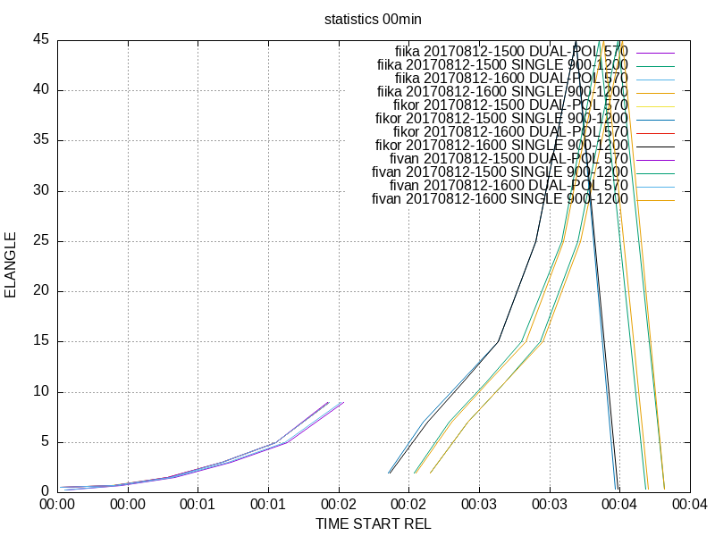

# Python3 utilities for Rack

Rack comes with a set of Python scripts packed as a module [rack](./rack).

General design principles and goals:
- Simple instruction set: to provide a minimal, simple set of parameters for a user 
- User-friendly hands-on usage: the user is not expected to know command line options of Rack, and especially not the order in which they should be given.
- Consistency: the scripts in this module share many common options, for example. 

## Contents

- [`rack.composer`](rack/composer.py) - utility for compositing data
- [`rack.statistics`](rack/statistics.py) - utility for extracting metadata from ODIM-HDF5 files, esp. for monitoring incoming data


### Statistics

Usage of this program - [`rack.statistics.py`](rack/statistics.py) consists typically of two steps
1. Collection of statistics - option `--ccc`
2. Illustration collect of statistics - option `--ccc`

In the collection stage, this script invokes `rack` repeatedly as a subprocess.
Similarly, in the illustration stage, `gnuplot` is invoked.

## Examples

In the following examples, it is assumed that environment variable `$PYTHONPATH` contains the directory under which the modules are localed.
.
```bash
# Daywise file of for sweep (identified by dataset<N>):
python3 -m rack.statistics  --outdir_syntax './stats1/{SITE}/{MINUTE}min/dataset{DATASET}'  --outfile_syntax '{MONTH}{DAY}_{POL}_{ELANGLE}_{PRF}_{GEOM}.txt' data-acc/201703061200_radar.polar.fiuta.h5

# Files for each volume, separated by polarization modes and pulse repetition modes:
python3 -m rack.statistics  --outdir_syntax './stats1/{SITE}'  --outfile_syntax '{TIMESTAMP}_{POL}_{PRF}.txt' 
```
Produces:
```
Test
```

It is useful to define data row syntax as a environment variable (like `$line_syntax`) because collection and illustration stage rely on a same order of data variables.
```bash

LINE='{TIME_START|%Y-%m-%dT%H:%M} {TIME_START_REL|%s} {ELANGLE} {TIME_END_REL|%s}  # {QUANTITY}'

python3 -m rack.statistics --line_syntax "$LINE"  --outfile_syntax '{TIME|%Y%m%d-%H%M}_{POL}_{PRF}.txt'   data-kiira/201708121?00_radar.polar.fi???.h5
python3 -m rack.statistics --gnuplot-columns TIME_START_REL,ELANGLE --LINE "$LINE" --gnuplot fin.png  statistics/fi???/??min/*.txt

gnuplot fin.png 
```




test.py
```python
import rack.statistics

parser = rack.statistics.build_parser()
args = parser.parse_args()

rack.statistics.run(args)
```

```bash
# PYTHONPATH=$PYTHONPATH:<path..>/scripts
python3 ./test.py   volume.h5
```
Produces:
```
[./statistics/fiuta/00min/01][2014-08-27T00:00_00.30_570_500x360x500]:  2014-08-27T00:00 2014-08-27T00:00 00.30 # TH-DBZH-VRAD-WRAD-ZDR-KDP-RHOHV-DBZHC-SQI-PHIDP-HCLASS-ZDRC-TX-DBZX
[./statistics/fiuta/00min/02][2014-08-27T00:00_00.70_570_500x360x500]:  2014-08-27T00:00 2014-08-27T00:24 00.70 # TH-DBZH-VRAD-WRAD-ZDR-KDP-RHOHV-DBZHC-SQI-PHIDP-HCLASS-ZDRC-TX-DBZX
[./statistics/fiuta/00min/03][2014-08-27T00:00_01.50_570_500x360x500]:  2014-08-27T00:00 2014-08-27T00:47 01.50 # TH-DBZH-VRAD-WRAD-ZDR-KDP-RHOHV-DBZHC-SQI-PHIDP-HCLASS-ZDRC-TX-DBZX
[./statistics/fiuta/00min/04][2014-08-27T00:00_03.00_570_500x360x500]:  2014-08-27T00:00 2014-08-27T01:10 03.00 # TH-DBZH-VRAD-WRAD-ZDR-KDP-RHOHV-DBZHC-SQI-PHIDP-HCLASS-ZDRC-TX-DBZX
[./statistics/fiuta/00min/05][2014-08-27T00:00_05.00_570_459x360x500]:  2014-08-27T00:00 2014-08-27T01:34 05.00 # TH-DBZH-VRAD-WRAD-ZDR-KDP-RHOHV-DBZHC-SQI-PHIDP-HCLASS-ZDRC-TX-DBZX
[./statistics/fiuta/00min/06][2014-08-27T00:00_09.00_570_256x360x500]:  2014-08-27T00:00 2014-08-27T01:57 09.00 # TH-DBZH-VRAD-WRAD-ZDR-KDP-RHOHV-DBZHC-SQI-PHIDP-HCLASS-ZDRC-TX-DBZX
[./statistics/fiuta/00min/07][2014-08-27T00:00_02.00_1200:900_248x360x500]:  2014-08-27T00:00 2014-08-27T02:22 02.00 # TH-DBZH-VRAD-WRAD-SQI
[./statistics/fiuta/00min/08][2014-08-27T00:00_07.00_1200:900_248x360x500]:  2014-08-27T00:00 2014-08-27T02:38 07.00 # TH-DBZH-VRAD-WRAD-SQI
[./statistics/fiuta/00min/09][2014-08-27T00:00_11.00_1200:900_210x360x500]:  2014-08-27T00:00 2014-08-27T02:53 11.00 # TH-DBZH-VRAD-WRAD-SQI
[./statistics/fiuta/00min/10][2014-08-27T00:00_15.00_1200:900_155x360x500]:  2014-08-27T00:00 2014-08-27T03:09 15.00 # TH-DBZH-VRAD-WRAD-SQI
[./statistics/fiuta/00min/11][2014-08-27T00:00_25.00_1200:900_95x360x500]:  2014-08-27T00:00 2014-08-27T03:25 25.00 # TH-DBZH-VRAD-WRAD-SQI
[./statistics/fiuta/00min/12][2014-08-27T00:00_45.00_1200:900_57x360x500]:  2014-08-27T00:00 2014-08-27T03:42 45.00 # TH-DBZH-VRAD-WRAD-SQI
[./statistics/fiuta/00min/13][2014-08-27T00:00_00.40_1200:900_992x360x125]:  2014-08-27T00:00 2014-08-27T04:00 00.40 # TH-DBZH-VRAD-WRAD-SQI
```


Explanation

| A                   | B                | C              | D          |
| ------------------- | ---------------- | -------------  | ---------- |
| Default             | `/dir`           | Test           | (None)     |


 
# Local build

